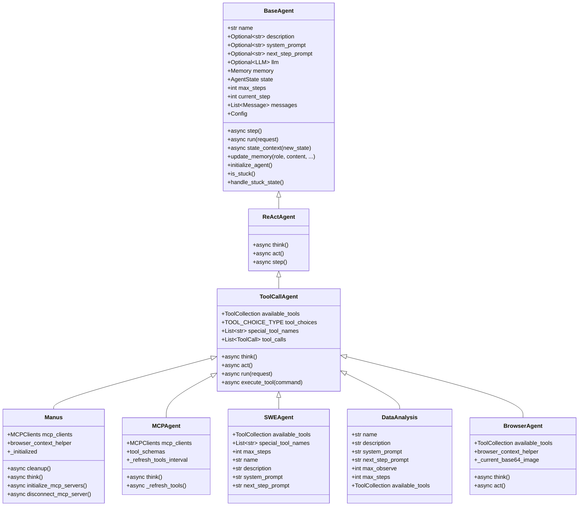
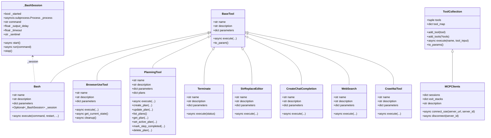
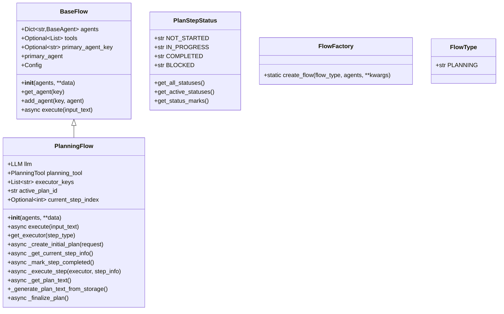
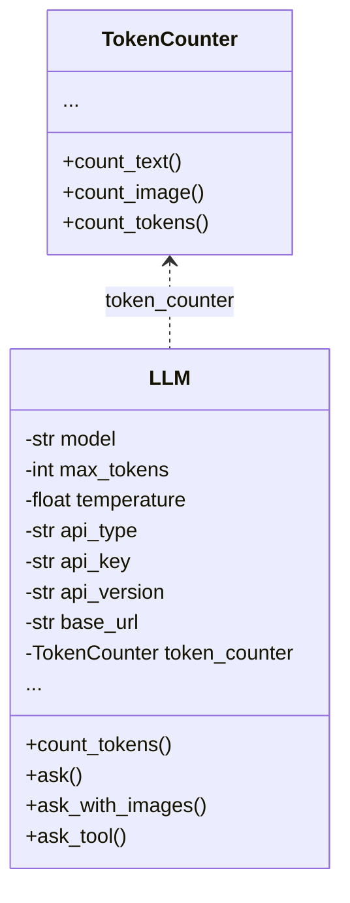

agent的主要实现和继承关系：

```mermaid


classDiagram
    class BaseAgent {
        +str name
        +Optional~str~ description
        +Optional~str~ system_prompt
        +Optional~str~ next_step_prompt
        +Optional~LLM~ llm
        +Memory memory
        +AgentState state
        +int max_steps
        +int current_step
        +async step()
        +async run(request)
        +async state_context(new_state)
        +update_memory(role, content, ...)
        +List~Message~ messages
        +initialize_agent()
        +is_stuck()
        +handle_stuck_state()
        +Config
    }

    class ReActAgent {
        +async think()
        +async act()
        +async step()
    }

    class ToolCallAgent {
        +ToolCollection available_tools
        +TOOL_CHOICE_TYPE tool_choices
        +List~str~ special_tool_names
        +List~ToolCall~ tool_calls
        +async think()
        +async act()
        +async run(request)
        +async execute_tool(command)
    }

    class Manus {
        +MCPClients mcp_clients
        +async cleanup()
        +async think()
        +async initialize_mcp_servers()
        +async disconnect_mcp_server()
        +browser_context_helper
        +_initialized
    }

    class MCPAgent {
        +MCPClients mcp_clients
        +async think()
        +async _refresh_tools()
        +tool_schemas
        +_refresh_tools_interval
    }

    class SWEAgent {
        +ToolCollection available_tools
        +List~str~ special_tool_names
        +int max_steps
        +str name
        +str description
        +str system_prompt
        +str next_step_prompt
    }

    class DataAnalysis {
        +str name
        +str description
        +str system_prompt
        +str next_step_prompt
        +int max_observe
        +int max_steps
        +ToolCollection available_tools
    }

    class BrowserAgent {
        +ToolCollection available_tools
        +async think()
        +async act()
        +browser_context_helper
        +_current_base64_image
    }

    %% 继承关系
    BaseAgent <|-- ReActAgent
    ReActAgent <|-- ToolCallAgent
    ToolCallAgent <|-- Manus
    ToolCallAgent <|-- MCPAgent
    ToolCallAgent <|-- SWEAgent
    ToolCallAgent <|-- DataAnalysis
    ToolCallAgent <|-- BrowserAgent

```

tool的主要实现和继承关系 :

```mermaid
classDiagram
    class BaseTool {
        +str name
        +str description
        +dict parameters
        +async execute(...)
        +to_param()
    }


        class _BashSession {
        +bool _started
        +asyncio.subprocess.Process _process
        +str command
        +float _output_delay
        +float _timeout
        +str _sentinel
        +async start()
        +async run(command)
        +stop()
    }


    class Bash {
        +str name
        +str description
        +dict parameters
        +Optional~_BashSession~ _session
        +async execute(command, restart, ...)
    }


    class BrowserUseTool {
        +str name
        +str description
        +dict parameters
        +async execute(...)
        +async get_current_state()
        +async cleanup()
    }

    class PlanningTool {
        +str name
        +str description
        +dict parameters
        +dict plans
        +async execute(...)
        +create_plan(...)
        +update_plan(...)
        +list_plans()
        +get_plan(...)
        +set_active_plan(...)
        +mark_step_completed(...)
        +delete_plan(...)
    }

    class Terminate {
        +str name
        +str description
        +dict parameters
        +async execute(status)
    }

    class StrReplaceEditor {
        +str name
        +str description
        +dict parameters
        +async execute(...)
    }

    class ToolCollection {
        +tuple tools
        +dict tool_map
        +add_tool(tool)
        +add_tools(*tools)
        +async execute(name, tool_input)
        +to_params()
    }

    class MCPClients {
        +dict sessions
        +dict exit_stacks
        +str description
        +async connect_sse(server_url, server_id)
        +async disconnect(server_id)
    }

    class CreateChatCompletion {
        +str name
        +str description
        +dict parameters
        +async execute(...)
    }

    class WebSearch {
        +str name
        +str description
        +dict parameters
        +async execute(...)
    }

    class Crawl4aiTool {
        +str name
        +str description
        +dict parameters
        +async execute(...)
    }

    %% 继承关系
    BaseTool <|-- Bash
    BaseTool <|-- BrowserUseTool
    BaseTool <|-- PlanningTool
    BaseTool <|-- Terminate
    BaseTool <|-- StrReplaceEditor
    BaseTool <|-- CreateChatCompletion
    BaseTool <|-- WebSearch
    BaseTool <|-- Crawl4aiTool
    ToolCollection <|-- MCPClients
    _BashSession <.. Bash:_session
    
```

flow的主要实现和继承关系:

```mermaid
classDiagram
    class BaseFlow {
        +Dict~str,BaseAgent~ agents
        +Optional~List~ tools
        +Optional~str~ primary_agent_key
        +__init__(agents, **data)
        +primary_agent
        +get_agent(key)
        +add_agent(key, agent)
        +async execute(input_text)
        +Config
    }

    class PlanningFlow {
        +LLM llm
        +PlanningTool planning_tool
        +List~str~ executor_keys
        +str active_plan_id
        +Optional~int~ current_step_index
        +__init__(agents, **data)
        +async execute(input_text)
        +get_executor(step_type)
        +async _create_initial_plan(request)
        +async _get_current_step_info()
        +async _mark_step_completed()
        +async _execute_step(executor, step_info)
        +async _get_plan_text()
        +_generate_plan_text_from_storage()
        +async _finalize_plan()
    }

    class PlanStepStatus {
        +str NOT_STARTED
        +str IN_PROGRESS
        +str COMPLETED
        +str BLOCKED
        +get_all_statuses()
        +get_active_statuses()
        +get_status_marks()
    }

    class FlowFactory {
        +static create_flow(flow_type, agents, **kwargs)
    }

    class FlowType {
        +str PLANNING
    }

    BaseFlow <|-- PlanningFlow
```

llm的主要实现和继承关系:

```mermaid
classDiagram
    class TokenCounter
    class LLM

    TokenCounter <.. LLM : token_counter

    class TokenCounter {
        +count_text()
        +count_image()
        +count_tokens()
        ...
    }
    class LLM {
        -str model
        -int max_tokens
        -float temperature
        -str api_type
        -str api_key
        -str api_version
        -str base_url
        -TokenCounter token_counter
        +count_tokens()
        +ask()
        +ask_with_images()
        +ask_tool()
        ...
    }
```