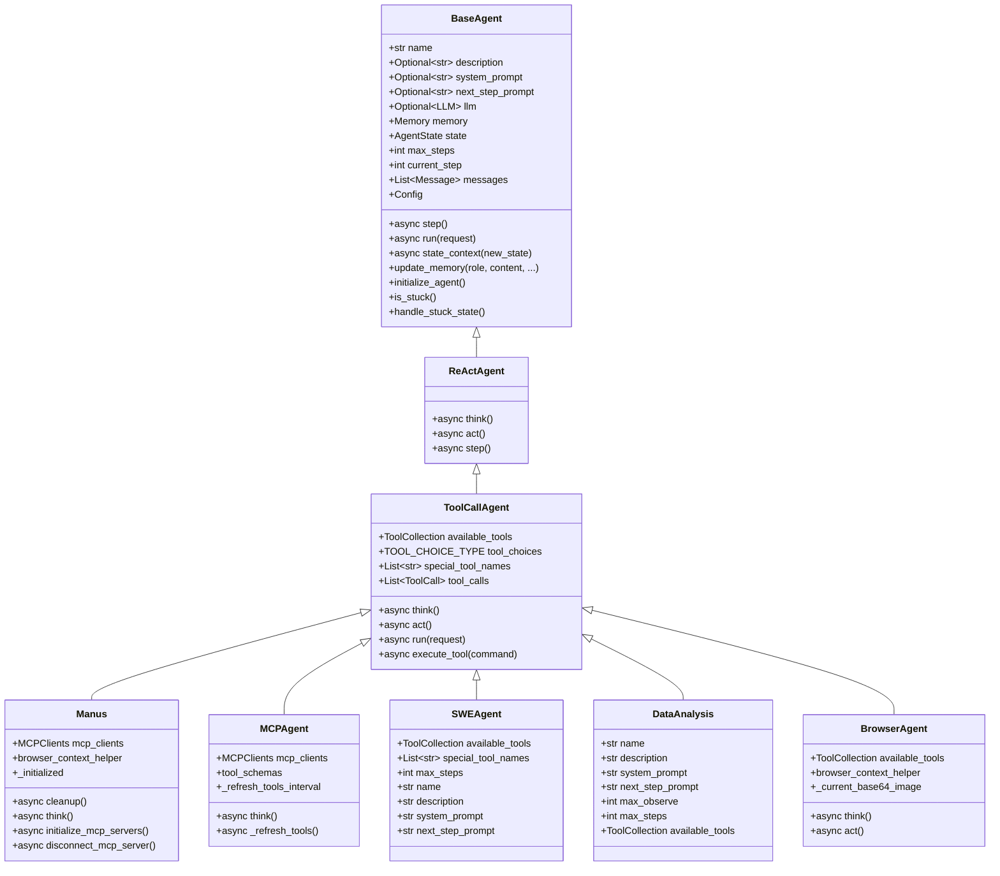

```mermaid


classDiagram
    class BaseAgent {
        +str name
        +Optional~str~ description
        +Optional~str~ system_prompt
        +Optional~str~ next_step_prompt
        +Optional~LLM~ llm
        +Memory memory
        +AgentState state
        +int max_steps
        +int current_step
        +async step()
        +async run(request)
        +async state_context(new_state)
        +update_memory(role, content, ...)
        +List~Message~ messages
        +initialize_agent()
        +is_stuck()
        +handle_stuck_state()
        +Config
    }

    class ReActAgent {
        +async think()
        +async act()
        +async step()
    }

    class ToolCallAgent {
        +ToolCollection available_tools
        +TOOL_CHOICE_TYPE tool_choices
        +List~str~ special_tool_names
        +List~ToolCall~ tool_calls
        +async think()
        +async act()
        +async run(request)
        +async execute_tool(command)
    }

    class Manus {
        +MCPClients mcp_clients
        +async cleanup()
        +async think()
        +async initialize_mcp_servers()
        +async disconnect_mcp_server()
        +browser_context_helper
        +_initialized
    }

    class MCPAgent {
        +MCPClients mcp_clients
        +async think()
        +async _refresh_tools()
        +tool_schemas
        +_refresh_tools_interval
    }

    class SWEAgent {
        +ToolCollection available_tools
        +List~str~ special_tool_names
        +int max_steps
        +str name
        +str description
        +str system_prompt
        +str next_step_prompt
    }

    class DataAnalysis {
        +str name
        +str description
        +str system_prompt
        +str next_step_prompt
        +int max_observe
        +int max_steps
        +ToolCollection available_tools
    }

    class BrowserAgent {
        +ToolCollection available_tools
        +async think()
        +async act()
        +browser_context_helper
        +_current_base64_image
    }

    %% 继承关系
    BaseAgent <|-- ReActAgent
    ReActAgent <|-- ToolCallAgent
    ToolCallAgent <|-- Manus
    ToolCallAgent <|-- MCPAgent
    ToolCallAgent <|-- SWEAgent
    ToolCallAgent <|-- DataAnalysis
    ToolCallAgent <|-- BrowserAgent

```